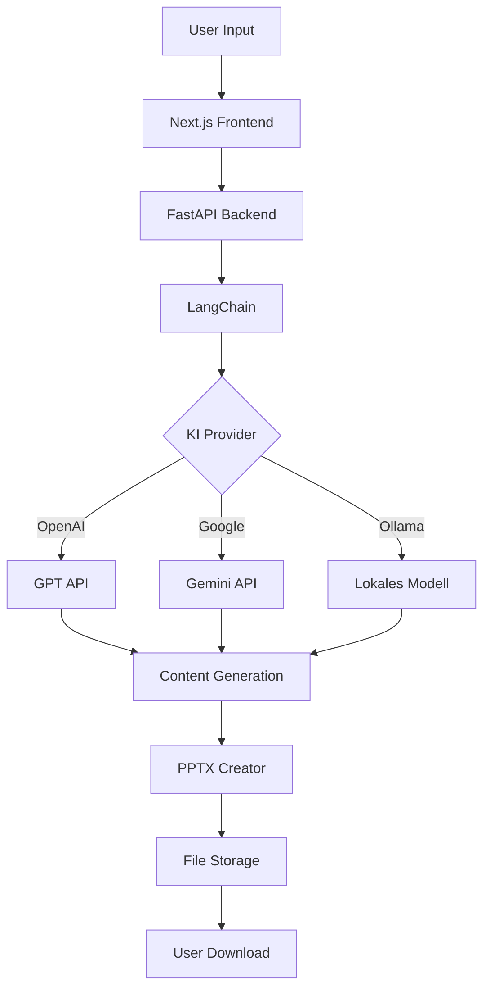

# Presenton App - Komplette Analyse

## 📋 **Überblick**
Presenton ist eine Open-Source KI-gestützte Präsentationsgenerator-App, die lokal läuft und als Alternative zu Gamma dient. Die App ermöglicht die Erstellung von Präsentationen durch verschiedene KI-Modelle.

## 🏗️ **Architektur**

### **Microservices-Architektur**
- **Frontend**: Next.js (React) - Port 3000
- **Backend**: FastAPI (Python) - Port 8000  
- **Reverse Proxy**: Nginx - Port 80
- **Datenbank**: SQLite mit SQLModel
- **Cache**: Redis
- **KI-Integration**: OpenAI, Google Gemini, Ollama

### **Containerisierung**
- **Dockerfile**: Multi-Stage Build mit Python 3.11
- **Docker Compose**: Development & Production Konfigurationen
- **Kubernetes**: Vollständige K8s Manifeste vorhanden

## 🔧 **Technologie-Stack**

### **Backend (FastAPI)**
```python
# Hauptkomponenten:
- FastAPI 0.115.12 (Web Framework)
- SQLModel 0.0.24 (ORM)
- LangChain 0.3.25 (KI Integration)
- OpenAI 1.78.1 (OpenAI API)
- Ollama 0.5.1 (Lokale Modelle)
- Redis 6.2.0 (Caching)
- Puppeteer (HTML/PDF Export)
```

### **Frontend (Next.js)**
```javascript
// Hauptbibliotheken:
- Next.js 14.2.14 (React Framework)
- Radix UI (Komponenten)
- TailwindCSS (Styling)
- Redux Toolkit (State Management)
- TipTap (Rich Text Editor)
- Puppeteer (Screenshot/Export)
```

### **Deployment-Optionen**
1. **Docker Container**: `docker run -p 5000:80`
2. **Docker Compose**: Development/Production
3. **Kubernetes**: Complete K8s setup
4. **Bare Metal**: Direct server deployment

## 🚀 **Kernfunktionen**

### **1. Präsentationserstellung**
- **Prompt-basiert**: Text → Präsentation
- **Dokumenten-Upload**: PDF, DOCX, TXT, PPTX
- **Gliederung**: Editierbare Outline
- **Themen**: 7 verschiedene Themes (light, dark, cream, etc.)
- **Sprachen**: Mehrsprachige Unterstützung

### **2. KI-Modelle**
```yaml
Unterstützte Modelle:
  OpenAI: GPT-4, GPT-3.5
  Google: Gemini Pro
  Ollama: 
    - Llama 3.1 (1B-405B)
    - Gemma (1B-27B)  
    - DeepSeek R1 (1.5B-671B)
    - Qwen (0.6B-235B)
```

### **3. Export-Formate**
- **PowerPoint (.pptx)**: Voll editierbar
- **PDF**: Druckfertig
- **Thumbnails**: Vorschau-Bilder

### **4. API-Endpunkte**
```yaml
Haupt-API:
  POST /api/v1/ppt/generate/presentation
  POST /api/v1/ppt/generate/outline
  POST /api/v1/ppt/upload/files
  GET  /api/v1/ppt/presentation/{id}
  PUT  /api/v1/ppt/slide/{id}
  DELETE /api/v1/ppt/presentation/{id}
```

## 🔐 **Sicherheit & Konfiguration**

### **Environment Variablen**
```bash
# Konfiguration:
CAN_CHANGE_KEYS=false        # UI Key-Änderung sperren
NODE_ENV=production          # Produktionsmodus
APP_DATA_DIRECTORY=/app/user_data
TEMP_DIRECTORY=/tmp/presenton

# KI-Provider:
LLM=openai|google|ollama
OPENAI_API_KEY=***
GOOGLE_API_KEY=***
OLLAMA_MODEL=llama3.2:3b
PEXELS_API_KEY=***

# Auth (Optional):
SESSION_SECRET_KEY=***
EIAM_CLIENT_ID=***
EIAM_CLIENT_SECRET=***
```

### **Security Features**
- **Non-root User**: Container als User 1000
- **Pod Security Policy**: K8s Security
- **Secrets Management**: Kubernetes Secrets
- **CORS**: Konfigurierbar
- **Session Management**: Secure Cookies

## 📊 **Datenfluss**



## 🗂️ **Projektstruktur**

```
presenton-main/
├── servers/
│   ├── fastapi/          # Python Backend
│   │   ├── api/          # API Routes & Models
│   │   ├── ppt_generator/ # PPTX Erstellung
│   │   ├── image_processor/ # Bildverarbeitung
│   │   └── document_processor/ # Dokumentenverarbeitung
│   └── nextjs/           # React Frontend
├── k8s/                  # Kubernetes Manifeste
├── docker-compose.yml    # Docker Konfiguration
├── Dockerfile           # Container Build
└── nginx.conf           # Reverse Proxy
```

## 🎯 **Use Cases**

### **1. Business Presentations**
- Unternehmenspräsentationen
- Produkt-Demos
- Sales Pitches

### **2. Educational Content**
- Lehrmaterialien
- Schulungsunterlagen
- Akademische Präsentationen

### **3. Technical Documentation**
- API-Dokumentation
- Technical Specs
- Architektur-Überblicke

## 🔧 **Deployment Guide**

### **Quick Start (Docker)**
```bash
docker run -it --name presenton \
  -p 5000:80 \
  -v "./user_data:/app/user_data" \
  -e LLM="openai" \
  -e OPENAI_API_KEY="***" \
  ghcr.io/presenton/presenton:v0.3.0-beta
```

### **Production (Kubernetes)**
```bash
# 1. Secrets konfigurieren
kubectl apply -f k8s/secrets.yaml

# 2. Deployment starten
kubectl apply -f k8s/deployment.yaml

# 3. Service exposen
kubectl apply -f k8s/service.yaml
```

## 📈 **Skalierbarkeit**

### **Horizontal Scaling**
- **Kubernetes**: HPA (Horizontal Pod Autoscaling)
- **Load Balancer**: Multiple Replicas
- **Database**: Redis Cluster für Caching

### **Performance**
- **GPU Support**: NVIDIA Container Toolkit
- **Model Caching**: Ollama Model Cache
- **CDN**: Static Asset Delivery

## 🚨 **Wichtige Hinweise**

### **Deprecated Status**
⚠️ **ACHTUNG**: Dieses Repository ist nicht mehr gewartet!  
Neue Version: https://github.com/presenton/presenton

### **Lizenz**
- **Apache 2.0**: Kommerzielle Nutzung erlaubt
- **Open Source**: Vollständiger Source Code verfügbar

### **Ressourcen**
- **Memory**: 2-4GB RAM empfohlen
- **CPU**: 1-2 Cores minimum
- **Storage**: 5-10GB für Modelle
- **GPU**: Optional für Ollama Beschleunigung

## 🔄 **Updates & Wartung**

### **Automated Updates**
- **GitHub Actions**: CI/CD Pipeline
- **Docker Registry**: Automated Builds
- **Kubernetes**: Rolling Updates

### **Monitoring**
- **Health Checks**: Liveness/Readiness Probes
- **Logging**: Strukturierte Logs
- **Metrics**: Prometheus Integration möglich

---

**Zusammenfassung**: Presenton ist eine vollständige, enterprise-fähige Präsentationsplattform mit moderner Microservices-Architektur, umfangreicher KI-Integration und flexiblen Deployment-Optionen.
